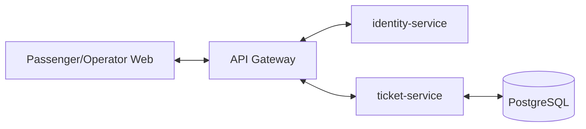
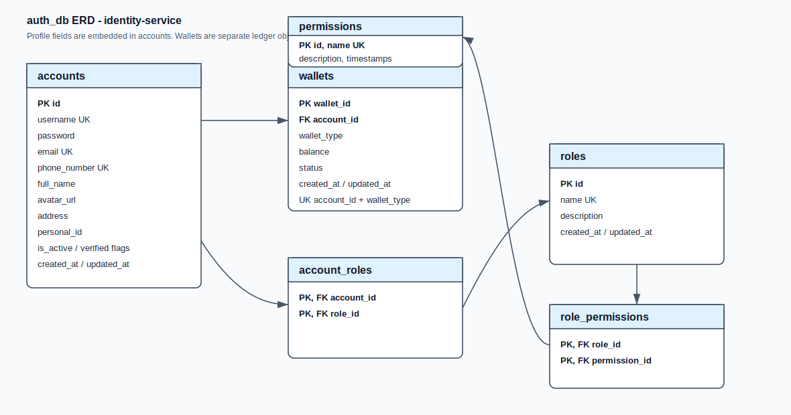
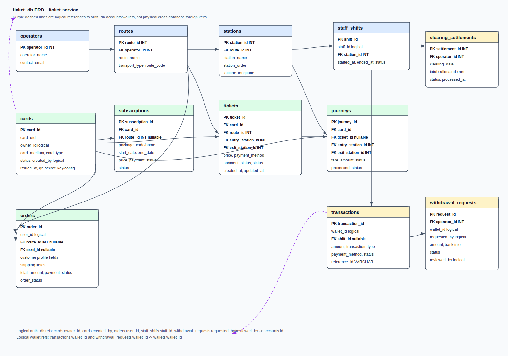
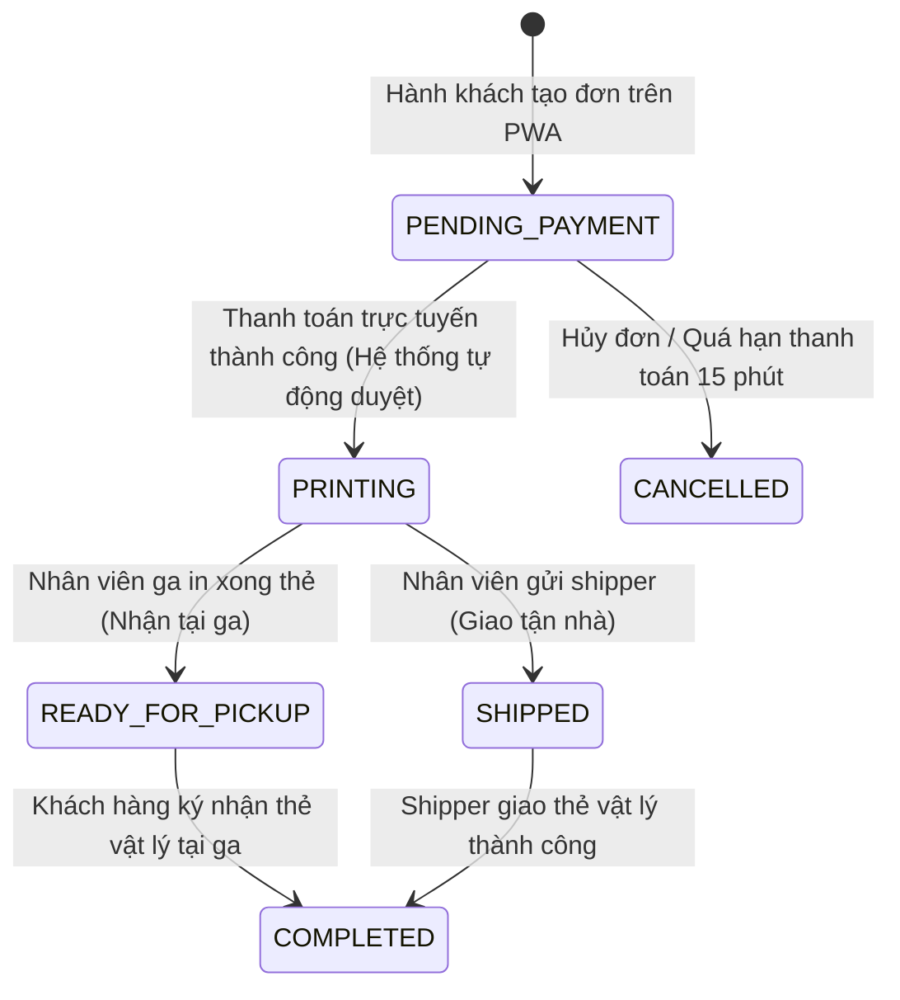
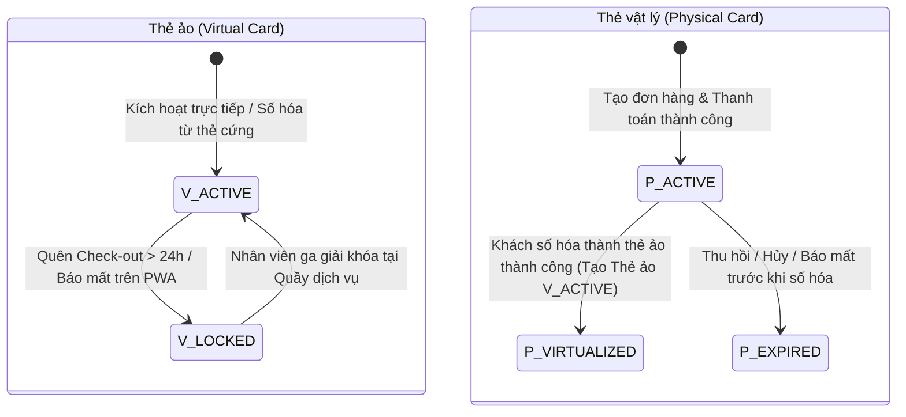
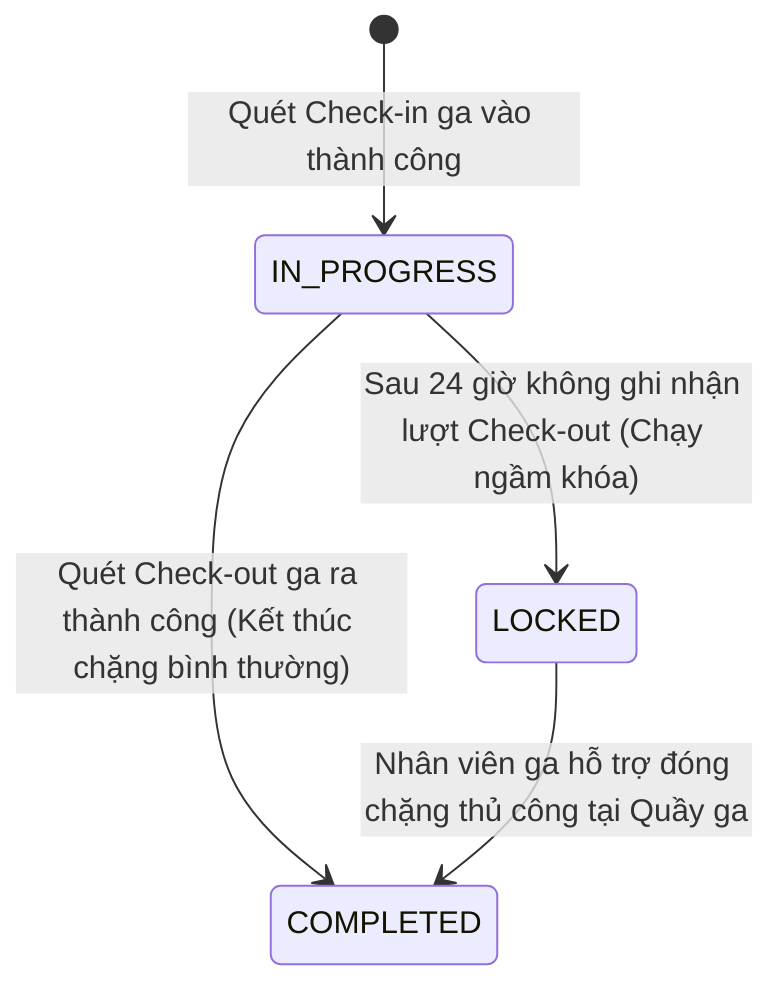
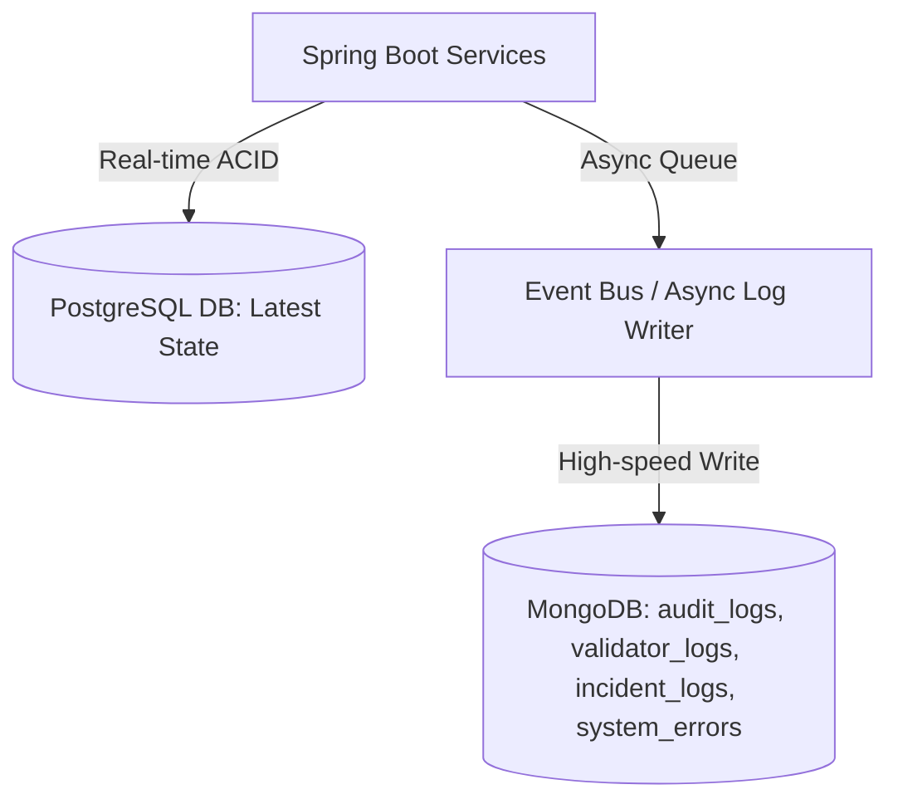

# TÀI LIỆU ĐẶC TẢ YÊU CẦU PHẦN MỀM (SOFTWARE REQUIREMENTS SPECIFICATION - SRS)
**Dự án:** Hệ thống Quản lý Vé tháng Giao thông Công cộng tự động (Period-based Fare Collection - PFC)  
**Mô hình áp dụng:** Period-Pass Subscription & Multi-tenant (Đa đơn vị vận hành liên thông)  
**Thời gian thực hiện:** 6 tuần  
**Tên tài liệu:** SRS_MetroTicket

---

## 1. GIỚI THIỆU TỔNG QUAN (INTRODUCTION)

### 1.1. Mục đích (Purpose)
| Nội dung | Mô tả |
| :--- | :--- |
| Mục tiêu tài liệu | Đặc tả yêu cầu phần mềm ở mức tổng quan cho hệ thống quản lý và soát vé tự động liên thông Bus & Metro. |
| Phạm vi mô tả trong SRS | Phạm vi nghiệp vụ, kiến trúc tổng quát, quyết định thiết kế chính, schema dữ liệu, enum/state và yêu cầu phi chức năng. |
| Tài liệu chi tiết liên quan | Luồng use case chi tiết xem [use_case_specifications.md](use_case_specifications.md); vai trò/quyền/scope dữ liệu xem [role_and_scope_analysis.md](role_and_scope_analysis.md). |
| Nguyên tắc tránh trùng lặp | SRS không lặp lại toàn bộ use case và ma trận role; chỉ giữ baseline và link tới tài liệu chuyên trách. |

### 1.2. Phạm vi dự án (Scope)
Hệ thống PFC được thiết kế theo mô hình **Thu soát vé tự động (Automated Fare Collection - AFC)** kết hợp **Vé tháng/Vé chu kỳ trả trước (Period Passes & Subscriptions)**, **Vé chặng lẻ dùng 1 lần (Single-Journey Tickets)** và **Ví điện tử nội bộ đa đối tượng (Multi-user Wallet Ledger)**.

| Nhóm phạm vi | Nội dung trong MVP | Ràng buộc/ngoài phạm vi |
| :--- | :--- | :--- |
| Hành khách (`PASSENGER`) | Đăng ký/đăng nhập OTP, quản lý hồ sơ, nạp ví, mua/gia hạn vé, phát hành thẻ ảo, số hóa thẻ cứng, dùng Dynamic QR để soát vé. | Không rút tiền khỏi ví; không mua thẻ cứng trên PWA; không nạp tiền hoặc trừ ví tại validator. |
| Đơn vị vận hành (`OPERATOR` / `COMPANY_MANAGER`) | Theo dõi ví doanh nghiệp, lịch sử cộng tiền đối soát, gửi yêu cầu giải ngân thủ công, quản lý tuyến/trạm/nhân sự/biểu giá trong phạm vi tenant. | Hệ thống không chuyển khoản ngân hàng tự động; Platform Manager chỉ duyệt/từ chối yêu cầu trên hệ thống. |
| Quản trị nền tảng (`PLATFORM_MANAGER`) | Quản lý tenant, khung giá trần, clearing, giám sát dòng tiền và duyệt/từ chối yêu cầu giải ngân doanh nghiệp. | Không tự động thay thế quy trình kế toán/ngân hàng ngoài đời. |
| Staff/quầy ga (`STAFF`) | Khởi tạo phôi thẻ, in/giao/thu hồi thẻ cứng, mở ca/kết ca, hỗ trợ xử lý kẹt ga/quên check-out/đi quá chặng. | Webcam Gate Simulator không đọc RFID/thẻ cứng. |
| Validator Gate Simulator | Quét Dynamic QR của thẻ/vé điện tử, kiểm tra trạng thái vé/subscription và ghi nhận journey. | Không hỗ trợ vé giấy/token vật lý/RFID trong MVP. |
| Thành phần hệ thống | Web Hành khách PWA, Portal vận hành, Validator Gate giả lập, `identity-service`, `ticket-service`, PostgreSQL và MongoDB audit/log. | Các tích hợp AFC phần cứng thật để future phase. |
| Vận hành đoàn tàu | Không thuộc scope MVP backend ticketing/AFC. DOCX FEED chỉ dùng làm ngữ cảnh tham khảo Metro. | Không triển khai lịch chạy tàu, headway, dwell time, train set, service day hoặc kế hoạch khai thác đoàn tàu. |

### 1.3. Định nghĩa & Thuật ngữ (Definitions & Acronyms)
| Thuật ngữ | Định nghĩa |
| :--- | :--- |
| PFC (Period-based Fare Collection) | Hệ thống thu phí và soát vé dựa trên vé chu kỳ/vé tháng. |
| Single-Journey Ticket | Vé lượt đi một lần dạng điện tử QR, được mua và thanh toán trước. Cổng soát vé chỉ kiểm tra trạng thái vé, không trừ ví tại chỗ. |
| Period Pass / Subscription | Gói cước vé dài hạn Metro/Bus, đi lại theo tuyến/phạm vi đã đăng ký trong thời hạn mua. |
| Passenger Wallet | Ví nội bộ của hành khách để nạp tiền và thanh toán vé/gói vé. Passenger không được rút tiền khỏi ví trong MVP. |
| Operator Wallet | Ví/sổ sách nội bộ của công ty vận hành để nhận tiền đối soát và làm căn cứ gửi yêu cầu giải ngân thủ công. |
| Ledger Transactions | Nhật ký biến động số dư ví: nạp tiền, mua vé, cộng đối soát, `OPERATOR_PAYOUT`, giao dịch tiền mặt tại quầy. |
| Physical Card | Thẻ cứng được phát hành/bán/in/giao nhận tại Portal. Không được đọc trực tiếp bởi Webcam Gate Simulator; muốn dùng để đi lại phải số hóa sang thẻ điện tử. |
| Virtual Card | Thẻ điện tử trên PWA/App, hiển thị Dynamic QR và tham gia trực tiếp luồng soát vé giả lập. |
| Physical-to-Virtual Migration | Quy trình số hóa thẻ cứng sang thẻ ảo, di trú subscription còn hiệu lực và chuyển thẻ cứng sang `VIRTUALIZED`. |
| Virtual Single-Journey Ticket | Vé lượt ảo QR dùng một lần, thanh toán trước qua ví, `VNPAY_SANDBOX` ở dev hoặc `SEPAY`/VietQR ở production. |
| Validator Gate Simulator | Trang web giả lập cổng soát vé bằng webcam, dùng để quét Dynamic QR và mô phỏng check-in/check-out. |
| PWA (Progressive Web App) | Web app tự phục vụ trên điện thoại của hành khách để mua vé, quản lý ví/thẻ và hiển thị Dynamic QR. |

---

## 2. MÔ TẢ TỔNG QUÁT (GENERAL DESCRIPTION)

### 2.1. Kiến trúc hệ thống tổng quát
Hệ thống được tổ chức theo mô hình Microservices phân tách nghiệp vụ rõ ràng, trong đó hai dịch vụ cốt lõi là:
1.  **`identity-service`:** Quản lý tài khoản hành khách và đối tác, thông tin hồ sơ cá nhân, phân quyền và ví nội bộ. Hồ sơ cá nhân được gộp vào `accounts`; ví được tách thành bảng `wallets` vì là đối tượng sổ sách độc lập có biến động số dư và luồng giải ngân riêng.
2.  **`ticket-service` (Java Spring Boot):** Quản lý phôi thẻ, đơn đăng ký làm thẻ cứng trực tuyến (`orders`), quản lý các gói vé tháng (`subscriptions`), nhật ký lượt đi (`journeys`), soát vé Validator (kiểm tra hạn dùng vé tháng), tích hợp thanh toán VNPay Sandbox ở dev/Sepay ở production, biến động số dư và Clearing Scheduler chạy ngầm đối soát doanh thu phân bổ vào ví doanh nghiệp.



### 2.2. Kế hoạch triển khai 6 tuần
*   **Tuần 1:** Tài liệu nghiệp vụ (SRS), sơ đồ Sequence Diagram, thiết kế cơ sở dữ liệu (ERD) hỗ trợ quản lý ví điện tử, đơn hàng vé tháng và đăng ký thẻ trực tuyến.
*   **Tuần 2:** Đặc tả Swagger API và cài đặt Base Code Spring Boot `ticket-service`, tích hợp cổng thanh toán VNPay Sandbox cho môi trường dev, chuẩn bị adapter Sepay/VietQR cho môi trường production, tạo luồng nạp tiền ví và mua vé tháng từ ví.
*   **Tuần 3:** Phát triển UI App Hành khách (Mobile-First) cho phép nạp tiền ví, phát hành thẻ ảo QR Code động, số hóa thẻ cứng sang thẻ ảo, thanh toán mua vé tháng bằng ví hoặc ngân hàng. Luồng mua thẻ cứng ship tận nhà thuộc Web Portal Guest Checkout.
*   **Tuần 4:** Hiện thực hóa API Check-in/Check-out tại Gate Validator (Kiểm tra thời hạn hiệu lực vé tháng còn hạn, ghi nhận lượt đi).
*   **Tuần 5:** Phát triển Scheduler chạy ngầm đối soát doanh thu quỹ tổng và tự động cộng tiền phân bổ đối soát vào ví doanh nghiệp của các đơn vị thành viên.
*   **Tuần 6:** Hoàn thiện báo cáo kỹ thuật ($\le 30$ trang) và slide thuyết trình ($\le 20$ slide).

---

## 3. YÊU CẦU CHỨC NĂNG (FUNCTIONAL REQUIREMENTS)

Tài liệu SRS chỉ giữ vai trò mô tả phạm vi chức năng cấp cao, các quyết định nghiệp vụ nền tảng và ràng buộc triển khai. Đặc tả chi tiết từng luồng nghiệp vụ, actor, tiền điều kiện, hậu điều kiện, basic flow, alternative flow và exception flow được tách sang tài liệu use case riêng để tránh lặp nội dung và giảm độ dài SRS.

- **Đặc tả use case chi tiết:** [use_case_specifications.md](use_case_specifications.md)
- **Đặc tả vai trò, quyền và scope dữ liệu:** [role_and_scope_analysis.md](role_and_scope_analysis.md)

### 3.1. Functional Scope Baseline

Các nhóm chức năng MVP được khóa theo 27 use case trong `use_case_specifications.md`:

| Nhóm chức năng | Use case nguồn | Ghi chú scope trong SRS |
| :--- | :--- | :--- |
| Xác thực & tài khoản | UC01-UC06 | OTP cho passenger; username/password cho nhân sự nội bộ; profile nằm trong `accounts`. |
| Thẻ & vé tháng | UC07-UC12 | UC07 mua thẻ cứng chỉ dành cho Guest trên Web Portal; Passenger PWA chỉ phát hành thẻ ảo và số hóa thẻ cứng; soát vé chỉ dùng thẻ/vé điện tử qua Dynamic QR. |
| Soát vé & vận hành quầy ga | UC13-UC16 | Validator không trừ ví tại cổng; chỉ kiểm tra vé/subscription đã mua trước và ghi nhận journey. |
| Tài chính & ví điện tử | UC17-UC19 | Passenger chỉ nạp tiền và thanh toán vé; operator được gửi yêu cầu giải ngân thủ công; clearing chạy hằng đêm. |
| Quản trị vận hành đơn vị | UC20-UC22 | Company Manager quản lý nhân sự, tuyến/trạm và biểu giá trong phạm vi operator/tenant của mình. |
| Quản trị nền tảng | UC23-UC24 | Platform Manager quản lý tenant và khung giá trần toàn hệ thống. |
| Giám sát, bảo mật & phân quyền | UC25-UC27 | Admin quản trị kỹ thuật, ban/unban, RBAC và system logs; không tự ý can thiệp tài chính nếu không có audit flow. |

### 3.2. Business Rules Giữ Lại Trong SRS

- **Thanh toán:** Dev dùng `VNPAY_SANDBOX`; production dùng `SEPAY`/VietQR; thanh toán bằng ví dùng `WALLET`; giao dịch tiền mặt tại quầy dùng `CASH`.
- **Ví nội bộ:** Profile được gộp vào `accounts`; ví được tách thành `wallets` vì là sổ sách độc lập. Passenger không được rút tiền. Operator chỉ gửi yêu cầu giải ngân để Platform Manager duyệt/từ chối thủ công.
- **Thẻ vật lý:** Staff khởi tạo/bán/giao/in/quản lý thẻ cứng; Guest mua thẻ cứng qua Web Portal Guest Checkout; Passenger trên PWA chỉ số hóa thẻ cứng sang thẻ điện tử. Webcam Gate Simulator không hỗ trợ RFID/thẻ cứng.
- **Validator:** Cổng soát vé chỉ xác thực Dynamic QR của thẻ/vé điện tử đã mua trước, không nạp tiền/trừ tiền tại thời điểm quét.
- **Biểu giá/tuyến/ga:** Các bộ dữ liệu Hanoi/HCM trong tài liệu là seed/demo data theo operator/tenant, không phải giới hạn địa bàn của hệ thống.
- **Dữ liệu cấu hình resource:** `fare_policies`, `system_configs`, `route_stations`, `tenants/companies` được lưu thành các file JSON trong `src/main/resources` của backend, nạp vào `ConcurrentHashMap` khi khởi động để Fare Engine và API danh mục truy xuất O(1). Backend MVP không tạo thêm các bảng SQL này; dữ liệu lõi vẫn bám theo schema tối giản gồm `operators`, `routes`, `stations` và các bảng vé/giao dịch liên quan.
- **Fare Engine:** Công thức tính giá vé cụ thể được giữ trong SRS ở mục 3.4 bên dưới. Luồng soát vé/tính cự ly chi tiết xem UC13 và luồng cấu hình biểu giá tuyến xem UC22 trong [use_case_specifications.md](use_case_specifications.md).
- **Role & scope:** Ma trận quyền, ranh giới dữ liệu theo role và tenant isolation lấy theo [role_and_scope_analysis.md](role_and_scope_analysis.md).
- **Vận hành đoàn tàu:** Không triển khai module vận hành đoàn tàu trong MVP; các khái niệm headway, dwell time, turnaround, train set, service calendar chỉ là future phase nếu mở rộng ngoài ticketing/AFC.

### 3.3. Cấu Trúc Backend Resource JSON Cho Dữ Liệu Cấu Hình/Mock

Các nhóm dữ liệu dưới đây được đặt ở backend dưới dạng file JSON resource, ví dụ `src/main/resources/config/route_stations.json`, `fare_policies.json`, `system_configs.json`, `tenants.json`. Khi ứng dụng khởi động, backend đọc toàn bộ file vào `ConcurrentHashMap` trong RAM để phục vụ Fare Engine và các API danh mục với độ phức tạp truy xuất theo key là O(1). Đây **không phải schema SQL backend MVP**. Khi triển khai production thật, từng nhóm có thể được tách thành bảng hoặc API quản trị riêng nếu phát sinh nhu cầu audit, phân quyền sửa đổi và lịch sử hiệu lực phức tạp hơn.

#### 3.3.1. Nguyên tắc sử dụng

| Nhóm dữ liệu | File resource backend | Key cache RAM đề xuất | Backend SQL MVP tương ứng |
| :--- | :--- | :--- | :--- |
| `tenants` / `companies` | `tenants.json` | `operator_id` hoặc `company_code` | Bảng `operators` là source of truth backend. |
| `route_stations` | `route_stations.json` | `route_id`, `station_id`, hoặc composite `route_id:station_order` | Bảng `routes`, `stations`; `stations.route_id` và `stations.station_order` lưu quan hệ tuyến-trạm. |
| `fare_policies` | `fare_policies.json` | `policy_id` hoặc composite `operator_id:transport_type` | Không tạo bảng riêng; backend dùng resource config và Fare Engine trong MVP. |
| `system_configs` | `system_configs.json` | `config_key` | Không tạo bảng riêng; backend dùng resource config/environment config trong MVP. |

#### 3.3.2. Cấu trúc file `tenants.json`

```json
[
  {
    "tenant_id": "hn-metro",
    "operator_id": 1,
    "company_code": "HN_METRO",
    "company_name": "Hanoi Metro",
    "transport_modes": ["METRO"],
    "status": "ACTIVE",
    "service_fee_rate": 0.015
  },
  {
    "tenant_id": "hn-bus",
    "operator_id": 2,
    "company_code": "HN_BUS",
    "company_name": "Hanoi Bus",
    "transport_modes": ["BUS"],
    "status": "ACTIVE",
    "service_fee_rate": 0.015
  }
]
```

#### 3.3.3. Cấu trúc file `route_stations.json`

```json
[
  {
    "route_id": 101,
    "route_code": "METRO_2A",
    "operator_id": 1,
    "station_id": 1001,
    "station_code": "CAT_LINH",
    "station_name": "Cat Linh",
    "station_order": 1,
    "latitude": 21.0281,
    "longitude": 105.8342
  }
]
```

#### 3.3.4. Cấu trúc file `fare_policies.json`

```json
[
  {
    "policy_id": "FARE_HN_METRO_2025",
    "operator_id": 1,
    "transport_type": "METRO",
    "calculation_model": "STATION_COUNT",
    "effective_from": "2025-01-01",
    "effective_to": null,
    "status": "ACTIVE",
    "formula": {
      "base_fare": 8000,
      "step_fare": 1000,
      "min_fare": 9000
    }
  },
  {
    "policy_id": "FARE_HN_BUS_2025_FLAT",
    "operator_id": 2,
    "transport_type": "BUS",
    "calculation_model": "ROUTE_FLAT_FARE",
    "effective_from": "2025-01-01",
    "effective_to": null,
    "status": "ACTIVE",
    "tiers_config": [
      { "max_route_length_km": 15.0, "fare": 8000 },
      { "max_route_length_km": 25.0, "fare": 10000 },
      { "max_route_length_km": 30.0, "fare": 12000 },
      { "max_route_length_km": 40.0, "fare": 15000 },
      { "max_route_length_km": 999.0, "fare": 20000 }
    ]
  }
]
```

#### 3.3.5. Cấu trúc file `system_configs.json`

```json
[
  {
    "config_key": "payment.dev_provider",
    "config_value": "VNPAY_SANDBOX",
    "value_type": "STRING",
    "description": "Cong thanh toan dung cho moi truong dev"
  },
  {
    "config_key": "payment.prod_provider",
    "config_value": "SEPAY",
    "value_type": "STRING",
    "description": "Cong thanh toan/VietQR dung cho production"
  },
  {
    "config_key": "fare.bus.max_single_journey_fare",
    "config_value": 20000,
    "value_type": "NUMBER",
    "description": "Khung gia tran ve luot bus"
  },
  {
    "config_key": "qr.offline_totp.time_step_seconds",
    "config_value": 30,
    "value_type": "NUMBER",
    "description": "Chu ky sinh Dynamic QR offline TOTP"
  },
  {
    "config_key": "qr.offline_totp.allowed_drift_steps",
    "config_value": 1,
    "value_type": "NUMBER",
    "description": "So buoc lech thoi gian validator chap nhan"
  }
]
```

#### 3.3.6. Quy ước nạp RAM và cung cấp API

- Khi backend khởi động, `ResourceConfigLoader` đọc các file JSON resource, validate schema tối thiểu và nạp vào `ConcurrentHashMap`.
- Validator Check-in/out gọi API backend; Fare Engine lấy `fare_policies`, `route_stations`, `system_configs` trực tiếp từ RAM qua key id/composite key để tính tiền và cự ly với độ phức tạp O(1).
- Portal UI gọi API danh mục của backend, ví dụ `GET /api/config/tenants`, `GET /api/config/route-stations`, `GET /api/config/fare-policies`, `GET /api/config/system-configs`; frontend cache kết quả một lần khi load trang để giảm băng thông.
- `operator_id`, `route_id`, `station_id` trong resource JSON phải khớp với seed dữ liệu backend nếu demo chạy cùng API thật.
- Nếu cùng một dữ liệu tồn tại ở cả SQL và resource JSON, SQL/backend là nguồn đúng cho trạng thái nghiệp vụ; resource JSON chỉ là cấu hình/cache đọc nhanh cho danh mục và Fare Engine.
- Khi một nhóm cấu hình bắt đầu cần audit lịch sử, phân quyền chỉnh sửa runtime hoặc hiệu lực theo thời gian phức tạp, lúc đó mới tách khỏi resource JSON thành bảng/API quản trị riêng.

### 3.4. Công Thức Tính Giá Vé (Fare Engine Formula)

Biểu giá dưới đây là **seed/demo fare rule theo operator/tenant** để backend có công thức cụ thể khi triển khai MVP. Khi đổi địa bàn hoặc đơn vị vận hành, các giá trị này được cấu hình lại trong backend resource `fare_policies.json`, không cần đổi mã nguồn và không phát sinh bảng SQL riêng trong MVP.

#### 3.4.1. Vé lượt Metro theo số ga

| Điều kiện | Công thức/giá vé |
| :--- | :--- |
| `delta_S = 0` | `fare = 0` VNĐ |
| `delta_S = 1` | `fare = 9,000` VNĐ |
| `delta_S >= 2` | `fare = 8,000 + delta_S * 1,000` VNĐ |
| Biểu thức thu gọn với `delta_S >= 1` | `fare = max(9,000, 8,000 + delta_S * 1,000)` |

Trong đó:

- `delta_S = abs(exit_station.station_order - entry_station.station_order)`.
- Vé tháng/subscription hợp lệ không tính tiền theo lượt, `fare = 0`.
- Nếu vé lượt xuống quá ga đã mua, hệ thống so sánh `actual_delta_S` với `paid_delta_S` và chuyển khách sang quầy PSC để thu chênh lệch.

```json
{
  "rule_id": "FARE_METRO_STATION_COUNT_DEMO",
  "transport_type": "METRO",
  "calculation_model": "STATION_COUNT",
  "formula": {
    "base_fare": 8000,
    "step_fare": 1000,
    "min_fare": 9000
  }
}
```

#### 3.4.2. Vé lượt Bus theo chiều dài tuyến

| Chiều dài tuyến | Giá vé lượt |
| :--- | ---: |
| Dưới 15 km | 8,000 VNĐ |
| Từ 15 km đến dưới 25 km | 10,000 VNĐ |
| Từ 25 km đến dưới 30 km | 12,000 VNĐ |
| Từ 30 km đến dưới 40 km | 15,000 VNĐ |
| Từ 40 km trở lên | 20,000 VNĐ |

```json
{
  "rule_id": "FARE_BUS_ROUTE_FLAT_DEMO",
  "transport_type": "BUS",
  "calculation_model": "ROUTE_FLAT_FARE",
  "tiers_config": [
    { "max_route_length_km": 15.0, "fare": 8000 },
    { "max_route_length_km": 25.0, "fare": 10000 },
    { "max_route_length_km": 30.0, "fare": 12000 },
    { "max_route_length_km": 40.0, "fare": 15000 },
    { "max_route_length_km": 999.0, "fare": 20000 }
  ]
}
```

---

## 4. THIẾT KẾ CƠ SỞ DỮ LIỆU LIÊN DỊCH VỤ (MULTI-SERVICE DATABASE SPECIFICATION)
Để tuân thủ nguyên lý thiết kế Microservices độc lập (**Database-per-service**), hệ thống phân rã thành 2 cơ sở dữ liệu PostgreSQL vật lý riêng biệt:
1.  **`auth_db`:** Thuộc quyền quản lý của `identity-service`, chứa thông tin tài khoản, cấu trúc phân quyền động (RBAC/PBAC), thông tin cá nhân và ví nội bộ.
2.  **`ticket_db`:** Thuộc quyền quản lý của `ticket-service`, chứa thông tin thẻ vé, danh mục tuyến trạm, ca kíp nhân viên, nhật ký đi lại và báo cáo bù trừ doanh thu.

**Nguyên tắc liên kết:** Tuyệt đối không sử dụng khóa ngoại vật lý (`FOREIGN KEY`) chéo giữa hai database. Các mối quan hệ liên kết chéo dịch vụ được duy trì thuần túy về mặt **logic** thông qua mã tài khoản `accounts.id` và mã ví `wallets.wallet_id` tại tầng ứng dụng.

---

### 4.1. Sơ đồ Thực thể Cơ sở dữ liệu Liên dịch vụ (Enterprise ERD)

Mục này chỉ giữ bản đồ ERD ở mức định hướng. Phần SQL tại mục 4.2 và 4.3 là **source of truth** cho triển khai schema MVP. Nếu ảnh ERD chưa được regenerate sau khi thay đổi schema, ưu tiên đọc SQL bên dưới.

#### 4.1.1. Sơ đồ ERD Cơ sở dữ liệu `auth_db` (`identity-service`)



#### 4.1.2. Sơ đồ ERD Cơ sở dữ liệu `ticket_db` (`ticket-service`)


> Lưu ý: hai ảnh SVG trên phản ánh schema hiện tại; ưu tiên đọc SQL tại mục 4.2 và 4.3 nếu có khác biệt khi chỉnh tài liệu.

#### 4.1.3. Mô tả các mối liên kết Logic xuyên Database (Logical Cross-DB References)
Mặc dù hai cơ sở dữ liệu hoàn toàn độc lập về mặt vật lý để đảm bảo tính cô lập (Loosely Coupled), chúng vẫn duy trì mối liên hệ nghiệp vụ chặt chẽ thông qua các khóa tham chiếu logic tại tầng ứng dụng:
1.  **`cards.owner_id` $\rightarrow$ `accounts.id`**: Xác định chủ thể hành khách (`PASSENGER`) sở hữu thẻ cứng hoặc thẻ ảo.
2.  **`cards.created_by` $\rightarrow$ `accounts.id`**: Lưu vết ID của nhân viên quầy (`STAFF`) chịu trách nhiệm khởi tạo phôi thẻ cứng, bán/giao thẻ, in ấn thẻ cứng vật lý hoặc cập nhật trạng thái thẻ, phục vụ mục đích kiểm toán. Thẻ cứng không được dùng trực tiếp trong luồng quét Webcam Gate Simulator.
3.  **`staff_shifts.staff_id` $\rightarrow$ `accounts.id`**: Lưu vết ID của nhân viên ga (`STAFF`) trực tiếp phụ trách ca soát vé tại một trạm nhất định.
4.  **`orders.user_id` $\rightarrow$ `accounts.id`**: Xác định tài khoản khách hàng thực hiện gửi yêu cầu đăng ký mua thẻ cứng/vé tháng trực tuyến và thực hiện thanh toán.
5.  **`wallets.account_id` $\rightarrow$ `accounts.id`**: Liên kết ví nội bộ với tài khoản sở hữu bên `auth_db`.
6.  **`transactions.wallet_id` $\rightarrow$ `wallets.wallet_id`**: Liên kết logic biến động sổ cái giao dịch bên `ticket_db` sang ví nội bộ bên `auth_db`.

Vai trò, quyền thao tác và ranh giới dữ liệu theo từng actor không định nghĩa lại trong SRS; xem [role_and_scope_analysis.md](role_and_scope_analysis.md).

---

### 4.2. Đặc tả Cơ sở dữ liệu `auth_db` (`identity-service`)
Database `auth_db` tập trung quản lý thông tin tài khoản định danh, hồ sơ cá nhân, ví nội bộ và cơ chế phân quyền RBAC/PBAC. Hồ sơ cá nhân được gộp vào bảng `accounts` để giảm join trong truy vấn đăng nhập/hiển thị profile. Ví được tách thành bảng `wallets` vì là đối tượng sổ sách độc lập, có số dư, trạng thái, loại ví và liên quan tới lịch sử giao dịch/giải ngân.

#### 4.2.1. ERD `auth_db`


> Ảnh ERD này phản ánh schema hiện tại: profile nằm trong `accounts`, ví tách riêng ở `wallets`, RBAC dùng `roles`, `permissions`, `account_roles`, `role_permissions`.

#### 4.2.2. SQL schema `auth_db`

```sql
CREATE TABLE accounts (
    id VARCHAR(36) PRIMARY KEY,
    username VARCHAR(50) NOT NULL UNIQUE,
    password VARCHAR(100),
    email VARCHAR(100) UNIQUE,
    phone_number VARCHAR(15) UNIQUE,
    full_name VARCHAR(100),
    avatar_url VARCHAR(255),
    address VARCHAR(255),
    personal_id VARCHAR(20),
    is_active BOOLEAN DEFAULT TRUE,
    is_phone_verified BOOLEAN DEFAULT FALSE,
    is_email_verified BOOLEAN DEFAULT FALSE,
    created_at TIMESTAMP WITH TIME ZONE DEFAULT CURRENT_TIMESTAMP,
    updated_at TIMESTAMP WITH TIME ZONE DEFAULT CURRENT_TIMESTAMP
);

-- =========================================================================
-- 2. BẢNG WALLETS: Ví nội bộ và sổ sách số dư
-- =========================================================================
CREATE TABLE wallets (
    wallet_id UUID PRIMARY KEY DEFAULT gen_random_uuid(),
    account_id VARCHAR(36) NOT NULL REFERENCES accounts(id) ON DELETE CASCADE,
    wallet_type VARCHAR(20) NOT NULL, -- 'PASSENGER', 'OPERATOR', 'PLATFORM'
    balance DECIMAL(15, 2) NOT NULL DEFAULT 0.00,
    status VARCHAR(20) NOT NULL DEFAULT 'ACTIVE', -- 'ACTIVE', 'LOCKED', 'SUSPENDED'
    created_at TIMESTAMP WITH TIME ZONE DEFAULT CURRENT_TIMESTAMP,
    updated_at TIMESTAMP WITH TIME ZONE DEFAULT CURRENT_TIMESTAMP,
    UNIQUE (account_id, wallet_type)
);

-- =========================================================================
-- 3. BẢNG ROLES & PERMISSIONS: Phân quyền động hệ thống (RBAC)
-- =========================================================================
CREATE TABLE roles (
    id SERIAL PRIMARY KEY,
    name VARCHAR(50) NOT NULL UNIQUE,
    description TEXT,
    created_at TIMESTAMP WITH TIME ZONE DEFAULT CURRENT_TIMESTAMP,
    updated_at TIMESTAMP WITH TIME ZONE DEFAULT CURRENT_TIMESTAMP
);

CREATE TABLE permissions (
    id SERIAL PRIMARY KEY,
    name VARCHAR(100) NOT NULL UNIQUE,
    description TEXT,
    created_at TIMESTAMP WITH TIME ZONE DEFAULT CURRENT_TIMESTAMP,
    updated_at TIMESTAMP WITH TIME ZONE DEFAULT CURRENT_TIMESTAMP
);

CREATE TABLE account_roles (
    account_id VARCHAR(36) REFERENCES accounts(id) ON DELETE CASCADE,
    role_id INT REFERENCES roles(id) ON DELETE CASCADE,
    PRIMARY KEY (account_id, role_id)
);

CREATE TABLE role_permissions (
    role_id INT REFERENCES roles(id) ON DELETE CASCADE,
    permission_id INT REFERENCES permissions(id) ON DELETE CASCADE,
    PRIMARY KEY (role_id, permission_id)
);
```

---

### 4.3. Đặc tả Cơ sở dữ liệu `ticket_db` (`ticket-service`)

Database `ticket_db` quản lý danh mục vận hành (tuyến, trạm, đơn vị vận hành), thông tin thẻ vé, các gói vé tháng đăng ký (`subscriptions`), đơn hàng thẻ cứng trực tuyến (`orders`), lịch sử chuyến đi, giao dịch tài chính chặng, phân ca kíp nhân viên ga và bù trừ đối soát cuối ngày. Schema ưu tiên gộp các cấu hình nhỏ vào bảng nghiệp vụ chính; chỉ tách bảng khi dữ liệu là một đối tượng độc lập hoặc có quan hệ 1-n rõ ràng.

Các trường liên kết người dùng (`owner_id`, `created_by`, `staff_id`, `user_id`) được định nghĩa kiểu `VARCHAR(36)` để ánh xạ logic với bảng `accounts`; các trường tài chính (`wallet_id`) ánh xạ logic với bảng `wallets` ở cơ sở dữ liệu `auth_db`.

#### 4.3.1. ERD `ticket_db`


> `owner_id`, `created_by`, `staff_id`, `user_id`, `requested_by`, `reviewed_by` là logical references sang `auth_db.accounts.id`. `wallet_id` là logical reference sang `auth_db.wallets.wallet_id`; không tạo foreign key vật lý chéo database.

#### 4.3.2. SQL schema `ticket_db`

```sql
-- =========================================================================
-- 1. BẢNG OPERATORS: Danh mục các công ty/đơn vị vận hành thành viên (Tenants)
-- =========================================================================
CREATE TABLE operators (
    operator_id INT GENERATED BY DEFAULT AS IDENTITY PRIMARY KEY,
    operator_name VARCHAR(150) NOT NULL,
    contact_email VARCHAR(255),
    created_at TIMESTAMP WITH TIME ZONE DEFAULT CURRENT_TIMESTAMP
);

-- =========================================================================
-- 2. BẢNG ROUTES & STATIONS: Danh mục tuyến đường & nhà ga thuộc các đơn vị
-- =========================================================================
CREATE TABLE routes (
    route_id INT GENERATED BY DEFAULT AS IDENTITY PRIMARY KEY,
    operator_id INT REFERENCES operators(operator_id) ON DELETE CASCADE,
    route_name VARCHAR(100) NOT NULL,
    transport_type VARCHAR(30) NOT NULL, -- 'METRO', 'BUS'
    route_code VARCHAR(20) UNIQUE NOT NULL
);

CREATE TABLE stations (
    station_id INT GENERATED BY DEFAULT AS IDENTITY PRIMARY KEY,
    route_id INT REFERENCES routes(route_id) ON DELETE CASCADE,
    station_name VARCHAR(150) NOT NULL,
    station_order INT NOT NULL, -- Thứ tự trạm phục vụ tính cự ly soát vé
    latitude DECIMAL(9, 6),
    longitude DECIMAL(9, 6)
);

-- =========================================================================
-- 3. BẢNG CARDS: Quản lý vòng đời phôi thẻ và liên kết hành khách
-- =========================================================================
CREATE TABLE cards (
    card_id UUID PRIMARY KEY DEFAULT gen_random_uuid(),
    card_uid VARCHAR(50) NOT NULL, -- Mã số định danh hiển thị trên thẻ (gửi qua email/in trên phôi)
    owner_id VARCHAR(36), -- Khóa ngoại logic liên kết tài khoản PASSENGER bên auth_db
    card_medium VARCHAR(20) NOT NULL, -- 'PHYSICAL' (Thẻ cứng), 'VIRTUAL' (Thẻ điện tử ảo trên App)
    card_type VARCHAR(30) NOT NULL, -- 'ADULT' (Thường)
    status VARCHAR(20) DEFAULT 'ACTIVE', -- 'ACTIVE', 'LOCKED' (chỉ thẻ ảo), 'VIRTUALIZED' (thẻ cứng đã số hóa), 'EXPIRED'
    issued_at TIMESTAMP WITH TIME ZONE DEFAULT CURRENT_TIMESTAMP,
    created_by VARCHAR(36), -- Khóa ngoại logic liên kết tài khoản STAFF in ấn/giao nhận thẻ cứng
    qr_secret_key VARCHAR(255), -- Chỉ dùng cho thẻ ảo; secret đã mã hóa/bao bọc khóa để sinh Dynamic QR TOTP offline
    qr_algorithm VARCHAR(20) DEFAULT 'HMAC-SHA256',
    qr_time_step_seconds INT DEFAULT 30,
    qr_allowed_drift_steps INT DEFAULT 1,
    qr_secret_status VARCHAR(20) DEFAULT 'ACTIVE', -- 'ACTIVE', 'ROTATED', 'REVOKED'; NULL nếu không dùng QR
    qr_secret_rotated_at TIMESTAMP WITH TIME ZONE,
    CONSTRAINT uq_card_uid_medium UNIQUE (card_uid, card_medium) -- Đảm bảo một mã UID chỉ có tối đa 1 thẻ vật lý và 1 thẻ ảo đồng thời trong DB
);

-- 4. BẢNG SUBSCRIPTIONS: Quản lý các gói đăng ký vé tháng/chu kỳ đang chạy
-- =========================================================================
CREATE TABLE subscriptions (
    subscription_id UUID PRIMARY KEY DEFAULT gen_random_uuid(),
    card_id UUID REFERENCES cards(card_id) ON DELETE CASCADE,
    package_code VARCHAR(50) NOT NULL, -- Ví dụ: 'MONTHLY_ALL_ROUTE', 'DAILY_METRO'
    package_name VARCHAR(100) NOT NULL,
    duration_days INT NOT NULL, -- Số ngày hiệu lực (ví dụ: 1 ngày, 30 ngày)
    passenger_type VARCHAR(30) NOT NULL DEFAULT 'NORMAL',
    subscription_type VARCHAR(30) NOT NULL, -- 'BUS', 'METRO'
    route_id INT REFERENCES routes(route_id) ON DELETE SET NULL, -- Tuyến cụ thể nếu mua gói 1 tuyến, NULL nếu liên tuyến
    start_date DATE NOT NULL,
    end_date DATE NOT NULL,
    price DECIMAL(10, 2) NOT NULL, -- Giá vé đã thanh toán
    payment_status VARCHAR(20) DEFAULT 'PAID', -- 'PAID', 'PENDING'
    status VARCHAR(20) DEFAULT 'ACTIVE', -- 'ACTIVE' (còn hiệu lực), 'EXPIRED' (hết hạn), 'SUSPENDED' (tạm dừng)
    created_at TIMESTAMP WITH TIME ZONE DEFAULT CURRENT_TIMESTAMP
);

-- =========================================================================
-- 5. BẢNG TICKETS: Quản lý các vé lượt lẻ dùng 1 lần (Single-Journey Tickets)
-- =========================================================================
CREATE TABLE tickets (
    ticket_id UUID PRIMARY KEY DEFAULT gen_random_uuid(),
    card_id UUID NOT NULL REFERENCES cards(card_id) ON DELETE CASCADE, -- Thẻ cứng hoặc thẻ ảo liên kết khi mua
    ticket_type VARCHAR(20) NOT NULL, -- 'BUS', 'METRO'
    route_id INT REFERENCES routes(route_id) ON DELETE SET NULL, -- Tuyến xe bus hoặc tuyến Metro
    entry_station_id INT REFERENCES stations(station_id) ON DELETE SET NULL, -- Ga vào (chỉ dùng cho METRO)
    exit_station_id INT REFERENCES stations(station_id) ON DELETE SET NULL, -- Ga ra (chỉ dùng cho METRO)
    price DECIMAL(10, 2) NOT NULL, -- Giá vé lượt đã thanh toán
    payment_method VARCHAR(20) NOT NULL, -- 'VNPAY_SANDBOX', 'SEPAY', 'WALLET'
    payment_status VARCHAR(20) DEFAULT 'PENDING', -- 'PENDING', 'COMPLETED', 'FAILED', 'EXPIRED', 'MANUAL_REVIEW'
    status VARCHAR(20) DEFAULT 'ACTIVE', -- 'ACTIVE' (chờ sử dụng), 'IN_PROGRESS' (đang đi), 'USED' (đã sử dụng), 'EXPIRED' (hết hạn)
    created_at TIMESTAMP WITH TIME ZONE DEFAULT CURRENT_TIMESTAMP,
    updated_at TIMESTAMP WITH TIME ZONE DEFAULT CURRENT_TIMESTAMP
);

-- =========================================================================
-- 6. BẢNG ORDERS: Đơn hàng đăng ký mua thẻ cứng/vé tháng trực tuyến
-- =========================================================================
CREATE TABLE orders (
    order_id UUID PRIMARY KEY DEFAULT gen_random_uuid(),
    user_id VARCHAR(36), -- Khóa ngoại logic liên kết tài khoản PASSENGER bên auth_db (nullable nếu mua không cần đăng nhập)
    full_name VARCHAR(100) NOT NULL,
    birth_date DATE,
    personal_id VARCHAR(20), -- Số CCCD/Định danh cá nhân làm thẻ cứng
    phone_number VARCHAR(15) NOT NULL,
    email VARCHAR(100),
    passenger_type VARCHAR(30) NOT NULL, -- 'NORMAL'
    photo_url VARCHAR(255), -- Đường dẫn ảnh chân dung 3x4 in lên thẻ
    route_type VARCHAR(30) NOT NULL, -- 'ALL_ROUTES' (Liên tuyến), 'ONE_ROUTE' (Một tuyến)
    route_id INT REFERENCES routes(route_id) ON DELETE SET NULL, -- Tuyến cụ thể nếu mua 1 tuyến
    months_to_buy INT NOT NULL DEFAULT 1, -- Số chu kỳ tháng mua trước (ví dụ 1 tháng, 3 tháng...)
    shipping_method VARCHAR(30) NOT NULL, -- 'AT_STATION' (Nhận tại ga), 'HOME_DELIVERY' (Giao tận nhà)
    shipping_address TEXT, -- Địa chỉ nhận thẻ nếu ship tận nhà
    shipping_fee DECIMAL(10, 2) DEFAULT 0.00,
    card_price DECIMAL(10, 2) NOT NULL, -- Phí làm thẻ cứng vật lý (nếu có)
    ticket_price DECIMAL(10, 2) NOT NULL, -- Phí mua vé tháng
    total_amount DECIMAL(10, 2) NOT NULL, -- Tổng số tiền thanh toán
    payment_method VARCHAR(20) NOT NULL, -- 'VNPAY_SANDBOX', 'SEPAY', 'WALLET'
    payment_status VARCHAR(20) DEFAULT 'PENDING', -- 'PENDING', 'COMPLETED', 'FAILED', 'EXPIRED', 'MANUAL_REVIEW'
    order_status VARCHAR(20) DEFAULT 'PENDING_PAYMENT', -- 'PENDING_PAYMENT', 'PRINTING', 'READY_FOR_PICKUP', 'SHIPPED', 'COMPLETED', 'CANCELLED'
    card_id UUID REFERENCES cards(card_id) ON DELETE SET NULL, -- Được gán sau khi tạo thẻ vật lý thành công
    created_at TIMESTAMP WITH TIME ZONE DEFAULT CURRENT_TIMESTAMP,
    updated_at TIMESTAMP WITH TIME ZONE DEFAULT CURRENT_TIMESTAMP
);

-- =========================================================================
-- 7. BẢNG STAFF_SHIFTS: Quản lý phân ca trực kíp nhân viên nhà ga
-- =========================================================================
CREATE TABLE staff_shifts (
    shift_id UUID PRIMARY KEY DEFAULT gen_random_uuid(),
    staff_id VARCHAR(36) NOT NULL, -- Khóa ngoại logic liên kết tài khoản STAFF bên auth_db
    station_id INT REFERENCES stations(station_id) ON DELETE CASCADE, -- Ga trực ca
    started_at TIMESTAMP WITH TIME ZONE NOT NULL,
    ended_at TIMESTAMP WITH TIME ZONE,
    status VARCHAR(20) DEFAULT 'ACTIVE' -- 'ACTIVE' (đang mở ca), 'CLOSED' (đã khóa ca)
);

-- =========================================================================
-- 8. BẢNG JOURNEYS: Lịch sử và trạng thái các chuyến đi của hành khách
-- =========================================================================
CREATE TABLE journeys (
    journey_id UUID PRIMARY KEY DEFAULT gen_random_uuid(),
    card_id UUID REFERENCES cards(card_id) ON DELETE CASCADE, -- Nullable (nếu đi bằng thẻ ảo)
    ticket_id UUID REFERENCES tickets(ticket_id) ON DELETE CASCADE, -- Nullable (nếu đi bằng vé lượt ảo)
    entry_station_id INT REFERENCES stations(station_id) ON DELETE SET NULL,
    exit_station_id INT REFERENCES stations(station_id) ON DELETE SET NULL,
    started_at TIMESTAMP WITH TIME ZONE NOT NULL,
    ended_at TIMESTAMP WITH TIME ZONE,
    fare_amount DECIMAL(10, 2), -- Giá tiền chặng do Fare Engine tính toán (bằng 0 nếu dùng vé tháng)
    status VARCHAR(20) NOT NULL, -- 'IN_PROGRESS', 'COMPLETED', 'LOCKED' (Quên Check-out)
    processed_status VARCHAR(20) DEFAULT 'PENDING', -- 'PENDING' (Chờ đối soát), 'PROCESSED' (Đã đối soát)
    created_at TIMESTAMP WITH TIME ZONE DEFAULT CURRENT_TIMESTAMP
);

-- =========================================================================
-- 9. BẢNG TRANSACTIONS: Nhật ký giao dịch tài chính & tiền mặt ca trực
-- =========================================================================
CREATE TABLE transactions (
    transaction_id UUID PRIMARY KEY DEFAULT gen_random_uuid(),
    wallet_id UUID, -- Khóa ngoại logic liên kết wallets.wallet_id bên auth_db (nếu giao dịch qua ví)
    shift_id UUID REFERENCES staff_shifts(shift_id) ON DELETE SET NULL, -- Liên kết ca trực của STAFF nếu là giao dịch tiền mặt tại quầy ga
    amount DECIMAL(15, 2) NOT NULL, -- Số tiền giao dịch (+ cộng, - trừ)
    transaction_type VARCHAR(30) NOT NULL, -- 'TOP_UP', 'CASH_TOP_UP', 'PAY_SUBSCRIPTION', 'PAY_TICKET', 'CASH_FARE_ADJUSTMENT', 'CASH_PENALTY', 'CREDIT_CLEARING', 'OPERATOR_PAYOUT'
    payment_method VARCHAR(20), -- 'VNPAY_SANDBOX', 'SEPAY', 'WALLET', 'CASH', NULL nếu là clearing
    status VARCHAR(20) NOT NULL DEFAULT 'SUCCESS',-- 'PENDING', 'SUCCESS', 'FAILED', 'MANUAL_REVIEW'
    provider_transaction_id VARCHAR(100), -- Mã giao dịch từ VNPay/Sepay để chống callback trùng
    reference_id VARCHAR(36), -- ID tham chiếu logic đa bảng; lưu UUID hoặc INT dưới dạng chuỗi cho orders, journeys, clearing_settlements hoặc withdrawal_requests
    created_at TIMESTAMP WITH TIME ZONE DEFAULT CURRENT_TIMESTAMP
);

-- =========================================================================
-- 10. BẢNG CLEARING_SETTLEMENTS: Tổng hợp đối soát theo ngày và operator
-- =========================================================================
CREATE TABLE clearing_settlements (
    settlement_id INT GENERATED BY DEFAULT AS IDENTITY PRIMARY KEY,
    clearing_date DATE NOT NULL,
    operator_id INT REFERENCES operators(operator_id) ON DELETE CASCADE,
    total_transactions INT NOT NULL DEFAULT 0,
    total_collected DECIMAL(12, 2) NOT NULL,
    allocated_share DECIMAL(12, 2) NOT NULL,
    net_settlement DECIMAL(12, 2) NOT NULL,
    status VARCHAR(20) DEFAULT 'PROCESSED', -- 'PENDING', 'PROCESSED', 'FAILED'
    processed_at TIMESTAMP WITH TIME ZONE DEFAULT CURRENT_TIMESTAMP,
    UNIQUE (clearing_date, operator_id)
);

-- =========================================================================
-- 11. BẢNG WITHDRAWAL_REQUESTS: Yêu cầu giải ngân thủ công ví doanh nghiệp
-- =========================================================================
CREATE TABLE withdrawal_requests (
    request_id UUID PRIMARY KEY DEFAULT gen_random_uuid(),
    operator_id INT REFERENCES operators(operator_id) ON DELETE CASCADE,
    wallet_id UUID NOT NULL, -- Khóa ngoại logic liên kết wallets.wallet_id bên auth_db, chỉ nhận ví OPERATOR
    requested_by VARCHAR(36) NOT NULL, -- accounts.id của COMPANY_MANAGER tạo yêu cầu
    amount DECIMAL(15, 2) NOT NULL,
    bank_account_name VARCHAR(150) NOT NULL,
    bank_account_number VARCHAR(50) NOT NULL,
    bank_name VARCHAR(120) NOT NULL,
    status VARCHAR(20) NOT NULL DEFAULT 'PENDING', -- 'PENDING', 'APPROVED', 'REJECTED'
    reviewed_by VARCHAR(36), -- accounts.id của PLATFORM_MANAGER duyệt/từ chối
    reviewed_at TIMESTAMP WITH TIME ZONE,
    review_note TEXT,
    created_at TIMESTAMP WITH TIME ZONE DEFAULT CURRENT_TIMESTAMP
);
```

---

### 4.4. ĐỊNH NGHĨA HỆ ENUMS & SƠ ĐỒ CHUYỂN DỊCH TRẠNG THÁI (CORE ENUMS & STATE MACHINES)
Để đảm bảo tính đồng bộ tuyệt đối giữa mô tả tài liệu nghiệp vụ, mô hình dữ liệu (Database Schemas) và mã nguồn Spring Boot, hệ thống PFC quy ước chặt chẽ các tập dữ liệu Enum cốt lõi và các luồng chuyển dịch trạng thái (State Transitions) như sau:

#### 1. Enum `OrderStatus` (Trạng thái đơn mua thẻ cứng)
*   **Mô tả:** Quản lý vòng đời đơn đăng ký mua thẻ cứng vật lý trực tuyến của hành khách. Thẻ cứng chỉ được quản lý/bán/in/giao nhận và có thể số hóa sang thẻ điện tử; Webcam Gate Simulator không đọc thẻ cứng/RFID.
*   **Các giá trị định nghĩa:**
    *   `PENDING_PAYMENT`: Đơn hàng mới tạo, đang chờ khách thực hiện thanh toán online (qua VNPay Sandbox ở dev, Sepay/VietQR ở production hoặc số dư ví).
    *   `PRINTING`: Đơn đã thanh toán thành công, hệ thống tự động chuyển duyệt và đưa vào hàng chờ in ấn cơ học của nhân viên ga.
    *   `READY_FOR_PICKUP`: Thẻ cứng đã được nhân viên Portal in xong, đang chuẩn bị sẵn tại ga chờ hành khách đến nhận.
    *   `SHIPPED`: Thẻ cứng đã được đóng gói và bàn giao cho đơn vị chuyển phát nhanh (đối với hình thức giao hàng tận nhà).
    *   `COMPLETED`: Đơn hàng đã hoàn thành, thẻ cứng đã được trao tận tay khách hàng thành công.
    *   `CANCELLED`: Đơn hàng bị hủy do hành khách chủ động hủy hoặc quá hạn 15 phút chưa thanh toán.
*   **Luồng chuyển dịch trạng thái đơn hàng (Mermaid State Machine):**


#### 2. Enum `CardStatus` (Trạng thái thẻ)
*   **Mô tả:** Quản lý trạng thái hoạt động của thẻ trong hệ thống. Hệ thống **chỉ phục vụ quét soát vé cho thẻ ảo/thẻ điện tử** (`card_medium = 'VIRTUAL'`) thông qua mã Dynamic QR Code trên Web App (PWA). Thẻ vật lý cứng (`card_medium = 'PHYSICAL'`) sau khi mua chỉ có vai trò lưu thông tin để số hóa (convert) sang thẻ ảo và **hoàn toàn không hỗ trợ quét tại cổng kiểm soát**.
*   **Các giá trị định nghĩa:**
    *   `ACTIVE`: Thẻ ảo đang ở trạng thái hoạt động bình thường, sẵn sàng quét rào di chuyển; hoặc thẻ vật lý vừa phát hành hoạt động bình thường chờ số hóa.
    *   `LOCKED`: Thẻ ảo bị khóa tạm thời do quên Check-out quá 24 giờ khi di chuyển bằng tàu Metro, hoặc do hành khách báo mất trên ứng dụng PWA. Chỉ áp dụng cho thẻ ảo do thẻ vật lý không tham gia soát vé.
    *   `VIRTUALIZED`: Trạng thái **chỉ áp dụng cho thẻ vật lý cứng** sau khi hành khách thực hiện số hóa thành công thành thẻ ảo. Đây là trạng thái **vô hiệu hóa vĩnh viễn (terminal state)** của thực thể thẻ vật lý nhằm đánh dấu thẻ cứng đó đã được số hóa và ngăn chặn việc yêu cầu số hóa lặp lại.
    *   `EXPIRED`: Thẻ đã hết thời hạn sử dụng.
*   **Luồng chuyển dịch trạng thái thẻ (Mermaid State Machine):**


#### 3. Enum `JourneyStatus` (Trạng thái lượt di chuyển / Hành trình)
*   **Mô tả:** Quản lý vòng đời lượt đi của hành khách khi quét qua Validator.
*   **Các giá trị định nghĩa:**
    *   `IN_PROGRESS`: Hành khách đã quét Check-in ga vào thành công, đang trong hành trình di chuyển.
    *   `COMPLETED`: Hành khách đã quét Check-out ga ra thành công, kết thúc hành trình chuẩn chỉ.
    *   `LOCKED`: Chuyến đi bị treo do quên Check-out quá 24h, dẫn tới khóa phương tiện.
*   **Luồng chuyển dịch trạng thái chuyến đi (Mermaid State Machine):**


#### 4. Enum `SubscriptionStatus` (Trạng thái gói vé chu kỳ)
*   **Các giá trị:** `ACTIVE` (Gói cước vé chu kỳ còn hiệu lực), `EXPIRED` (Gói cước đã hết hạn dùng), `SUSPENDED` (Gói cước bị tạm dừng do thẻ bị báo mất hoặc tạm khóa).

#### 5. Enum `WalletType` (Phân loại ví nội bộ trên `wallets`)
*   **Các giá trị:** `PASSENGER` (Ví cá nhân khách hàng, chỉ nạp và chi mua vé, không rút tiền), `OPERATOR` (Ví doanh nghiệp vận hành, nhận đối soát và được gửi yêu cầu giải ngân thủ công), `PLATFORM` (Ví quỹ tổng hệ thống thu hộ).

#### 6. Enum `TransactionType` (Loại biến động số dư ví nội bộ & tiền mặt ca trực)
*   **Các giá trị:** `TOP_UP` (Nạp tiền ví online qua VNPay Sandbox ở dev hoặc Sepay/VietQR ở production), `CASH_TOP_UP` (Khách nạp tiền mặt vào ví tại quầy ga), `PAY_SUBSCRIPTION` (Thanh toán mua gói vé tháng/chu kỳ), `PAY_TICKET` (Thanh toán vé lượt), `CASH_FARE_ADJUSTMENT` (Khách trả tiền mặt bù quá chặng ga), `CASH_PENALTY` (Khách nộp phạt tiền mặt do quên check-out), `CREDIT_CLEARING` (Cộng tiền bù trừ đối soát phân bổ hằng đêm cho doanh nghiệp), `OPERATOR_PAYOUT` (Ghi nhận trừ sổ sách ví doanh nghiệp khi yêu cầu giải ngân thủ công được duyệt).

#### 7. Enum `TicketStatus` (Trạng thái vé lượt)
*   **Các giá trị:** `ACTIVE` (đã mua, chờ sử dụng), `IN_PROGRESS` (đã check-in với Metro), `USED` (đã hoàn tất/sử dụng), `EXPIRED` (hết hạn hoặc bị hủy).

#### 8. Enum `PaymentStatus` (Trạng thái thanh toán)
*   **Các giá trị:** `PENDING` (đang chờ callback/thanh toán), `COMPLETED` (thanh toán thành công), `FAILED` (thanh toán thất bại), `EXPIRED` (phiên thanh toán hết hạn), `MANUAL_REVIEW` (cần xử lý thủ công, thường do sai cú pháp chuyển khoản Sepay).

#### 9. Enum `WithdrawalRequestStatus` (Trạng thái yêu cầu giải ngân doanh nghiệp)
*   **Các giá trị:** `PENDING` (Company Manager đã gửi yêu cầu, chờ Platform Manager xử lý), `APPROVED` (Platform Manager đã chấp thuận và ghi nhận trừ sổ sách ví doanh nghiệp; việc chuyển khoản ngân hàng diễn ra ngoài hệ thống), `REJECTED` (Yêu cầu bị từ chối, số dư ví không thay đổi).

---

### 4.5. KIẾN TRÚC CSDL POLYGLOT PERSISTENCE & THIẾT KẾ MONGODB (AUDIT LOGS & SYSTEM LOGS)
Để bảo toàn hiệu năng vận hành giao dịch ACID thời gian thực tối ưu của PostgreSQL và ngăn ngừa nguy cơ phình to dung lượng ổ đĩa do dữ liệu lịch sử biến động (Audit Trail), hệ thống áp dụng kiến trúc **CSDL hỗn hợp Polyglot Persistence**:
1.  **PostgreSQL (Transactional Storage):** Lưu trữ trạng thái hiện tại (Latest State) duy nhất và sổ cái tài chính số dư ví. Ràng buộc quan hệ và chỉ mục chặt chẽ để đảm bảo tốc độ giao dịch tức thì.
2.  **MongoDB (Historical & Audit Logs Store):** Lưu trữ phi cấu trúc (NoSQL Document Store) toàn bộ vết lịch sử thay đổi trạng thái thực thể dưới dạng Snapshot JSON, cùng nhật ký hoạt động quẹt soát vé thời gian thực khổng lồ từ Validator. Ghi dữ liệu dạng phi đồng bộ (Async Writer) qua RabbitMQ/Kafka để tránh chặn luồng xử lý chính.



#### Thiết kế chi tiết các Collections trong MongoDB:

##### 1. Collection `audit_logs` (Nhật ký lịch sử biến động trạng thái)
Mỗi khi bất kỳ thực thể nghiệp vụ cốt lõi nào (`accounts`, `orders`, `cards`, `subscriptions`) thay đổi trạng thái hoặc dữ liệu trong PostgreSQL, hệ thống tự động lưu lại một tài liệu log chứa vết cũ, vết mới và snapshot JSON toàn bộ dữ liệu trước khi sửa:
```json
{
  "_id": "ObjectId",
  "entity_type": "ORDER",
  "entity_id": "8fa538e1-5120-410a-b31c-99d08479e02c",
  "actor_id": "36_char_accounts_id_or_SYSTEM",
  "action": "STATUS_CHANGE",
  "old_state": "PENDING_PAYMENT",
  "new_state": "PRINTING",
  "state_snapshot": {
    "order_id": "8fa538e1-5120-410a-b31c-99d08479e02c",
    "user_id": "account-uuid-111",
    "total_amount": 280000.00,
    "payment_method": "VNPAY_SANDBOX",
    "payment_status": "PENDING",
    "created_at": "2026-05-27T15:00:00Z"
  },
  "timestamp": "2026-05-27T15:14:19Z"
}
```

##### 2. Collection `validator_logs` (Nhật ký quẹt soát vé Validator)
Lưu toàn bộ các sự kiện hành khách quét mã QR tại cổng kiểm soát Validator ga xe bus và tàu điện ngầm để phục vụ báo cáo đối soát sản lượng và phát hiện gian lận:
```json
{
  "_id": "ObjectId",
  "transport_type": "METRO",
  "station_id": 12,
  "gate_id": "GATE_ENTER_02",
  "card_id": "8fa538e1-3333-410a-b31c-99d08479e02c",
  "card_uid": "METRO_CARD_12345678",
  "sweep_type": "CHECK_IN",
  "status": "SUCCESS",
  "error_code": null,
  "raw_qr_content": "SECURE_ENCRYPTED_QR_HASH_VALUE_30S",
  "timestamp": "2026-05-27T15:14:35Z"
}
```

##### 3. Collection `incident_logs` (Nhật ký sự cố hệ thống / Trạm ga)
Lưu trữ nhật ký các sự cố xảy ra tại trạm ga (như mất điện rào chắn, lỗi cổng kỹ thuật, sơ tán khẩn cấp) để tích hợp vào luồng xử lý "Giải khóa miễn phí (Free Override)" tự động của nhân viên ga:
```json
{
  "_id": "ObjectId",
  "station_id": 12,
  "incident_type": "POWER_FAILURE",
  "gate_id": "GATE_EXIT_04",
  "description": "Mất nguồn điện tổng hệ thống rào chắn, kích hoạt tự động fail-safe mở cổng",
  "reported_by": "staff-uuid-000",
  "started_at": "2026-05-27T10:00:00Z",
  "ended_at": "2026-05-27T10:45:00Z",
  "status": "RESOLVED"
}
```

##### 4. Collection `system_errors` (Nhật ký lỗi kỹ thuật và exception)
Lưu các lỗi kỹ thuật phát sinh trong backend, các lỗi retry thất bại, lỗi sinh mã định danh, lỗi callback thanh toán hoặc lỗi tích hợp ngoài. Collection này phục vụ UC27 tra cứu system logs và không lưu trạng thái nghiệp vụ hiện hành.
```json
{
  "_id": "ObjectId",
  "service_name": "ticket-service",
  "error_code": "CardUidGenerationFailedException",
  "level": "ERROR",
  "message": "Failed to generate unique card_uid after 3 retries",
  "trace_id": "trace-20260529-0001",
  "actor_id": "36_char_accounts_id_or_SYSTEM",
  "request_path": "/api/v1/cards/virtual",
  "payload_snapshot": {
    "account_id": "account-uuid-111",
    "card_medium": "VIRTUAL"
  },
  "created_at": "2026-05-27T15:14:19Z"
}
```

---

## 5. YÊU CẦU PHI CHỨC NĂNG & RÀNG BUỘC KỸ THUẬT (NON-FUNCTIONAL & CONSTRAINTS)

### 5.1. Tốc độ phản hồi quẹt soát vé (Performance)
*   API Gate Validator xử lý Check-in và Check-out bắt buộc phải hoàn thành dưới **300ms** để đảm bảo cửa mở tức thời tại ga.
*   *Giải pháp:* Sử dụng Redis Cache để lưu tạm trạng thái chuyến đi (`IN_PROGRESS`) và thời hạn/trạng thái vé tháng của các thẻ hoạt động tích cực để truy xuất siêu tốc mà không cần truy vấn PostgreSQL liên tục.

### 5.2. Ràng buộc Múi giờ hệ thống (System Timezone Constraint)
*   Vì dự án vận hành hoàn toàn tại Việt Nam, toàn bộ hệ thống từ OS Server, JVM của các microservices cho đến Database PostgreSQL bắt buộc phải được đồng bộ chạy trên múi giờ **UTC+7 (Asia/Ho_Chi_Minh)**.
*   *Lợi ích:* 
    *   Đồng bộ giờ Logs và dữ liệu CSDL trùng khớp 100% giờ thực tế, triệt tiêu lỗi lệch ngày kế toán.
    *   Các batch job chạy ngầm đối soát lúc 2:00 sáng sẽ được kích hoạt chính xác thời gian thực tế tại Việt Nam.

### 5.3. Bảo mật mã QR Code động (Dynamic QR Security)
*   Để chống chụp ảnh màn hình hoặc đi lậu vé, mã QR hiển thị trên ứng dụng của hành khách phải là mã QR động theo cơ chế TOTP, có chu kỳ xoay vòng tối đa **30 giây**.
*   MVP hỗ trợ QR offline TOTP: backend sinh `qr_secret_key` khi phát hành thẻ ảo, lưu trực tiếp trong bảng `cards` cùng các cột `qr_algorithm`, `qr_time_step_seconds`, `qr_allowed_drift_steps`, đồng bộ khóa xuống PWA, và validator/backend dùng cùng thuật toán để đối sánh mã trong cửa sổ thời gian hợp lệ.
*   Backend vẫn kiểm tra trạng thái tài khoản, thẻ, vé/subscription và blacklist khi validator gửi yêu cầu xác thực; QR offline chỉ giúp PWA sinh mã khi thiết bị hành khách mất mạng, không bỏ qua kiểm tra nghiệp vụ phía hệ thống.
